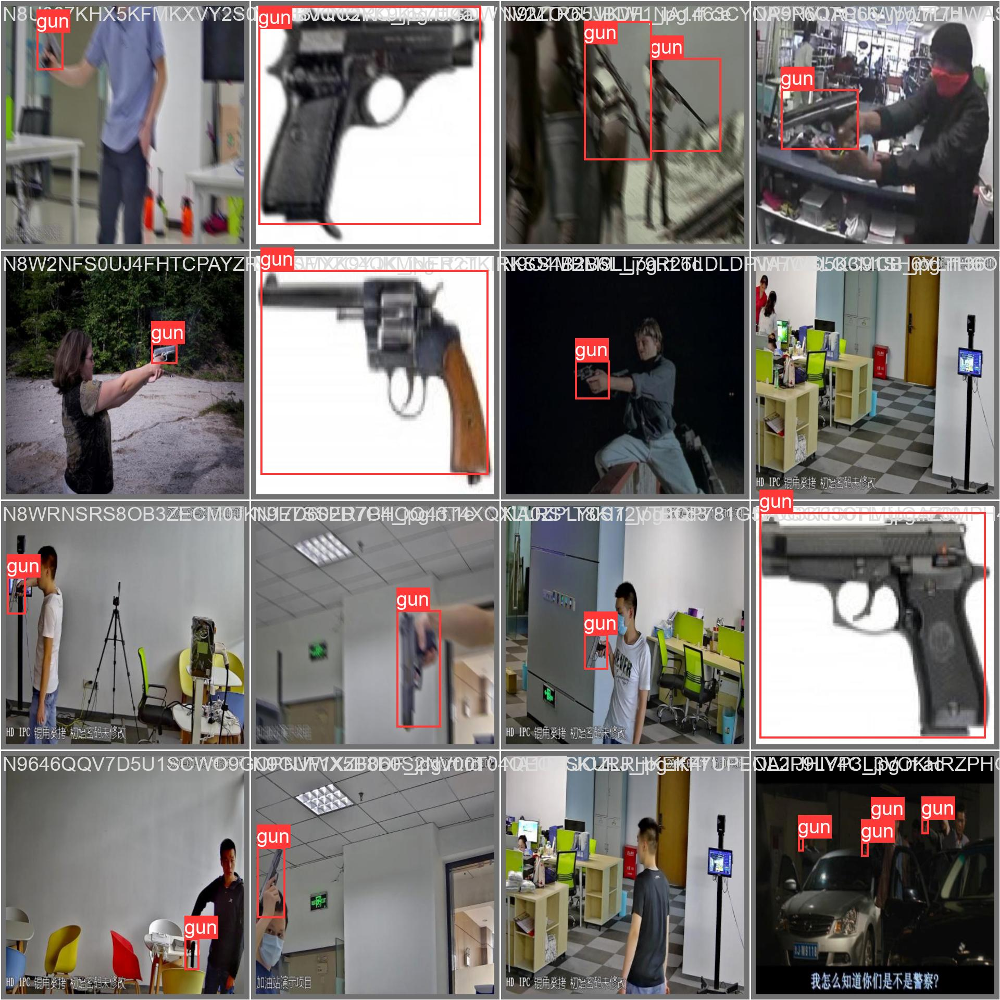
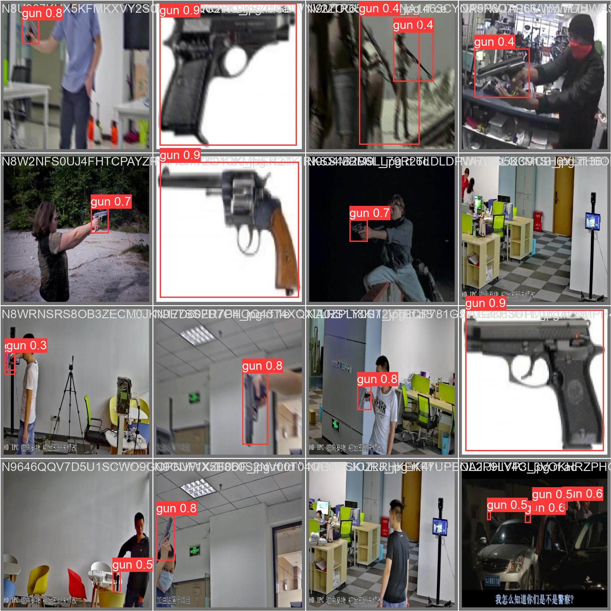
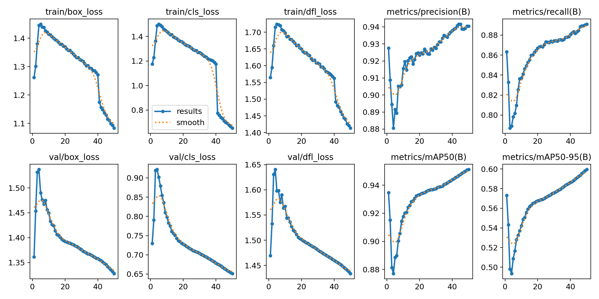
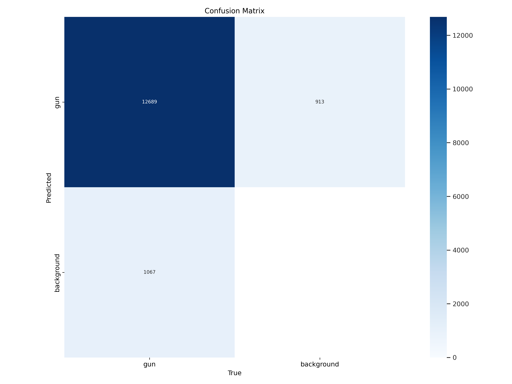
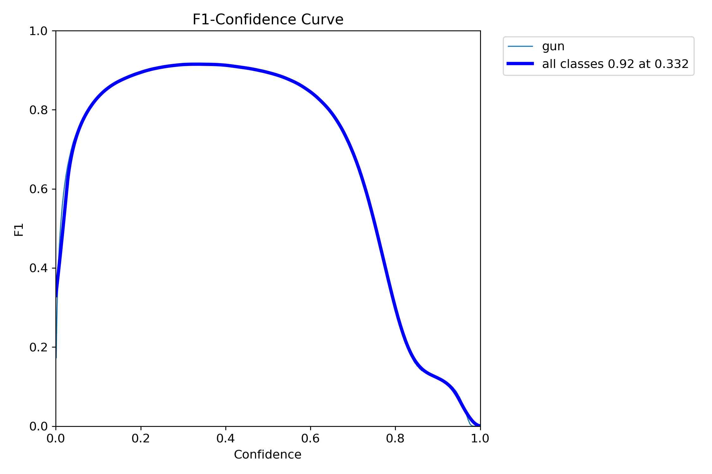

## Dataset Preparation
In this stage, an opensource dataset for guns is available with 70k images and having a single class "gun". Following steps are performed
1. Download a [dataset](https://universe.roboflow.com/phillip-lavrador/70k-guns/dataset/5) in yolo format.
2. Set the train, test and valdiation folder with their corresponding labels 
3. Modify the data.yaml file to our requirement with a single class "gun"

## Model Training and Validation
In this stage, a pretrained yolov8n model is retrained using transfer learning method. Following steps are performed in this stage
1. Loading a pretrained "yolov8n.pt" model.
2. Set the hyper parameters value to avoid overfitting as there is a single class with 70k images
3. To avoid overfitting dropout rate is set to 0.10 and data augmentation has been performed like flipping, rotation, mixup and copy pasting techniques.
4. First the model is trained for 50 epochs and results are observed.
5. By looking at the results the model is trained for 50 epochs more.
6. The final model has average precision mAP50-95 is 60%.

## Final Model Results
### Validation Set Results
#### Actual Labels

#### Predicted Labels 

### Training Result 

### Confusion Matrix

### F1 Curve

## Model Testing
1. [Testing Result on High Resolution Video](https://drive.google.com/file/d/1mQstDsqBdkPX3cvurcvFXeWjNLxZGiZY/view?usp=drive_link)
2. [Testing Result on CCT Video](https://drive.google.com/file/d/1koxNsEQHFCO400td3l-luWhLfT7fKe7g/view?usp=drive_link)

